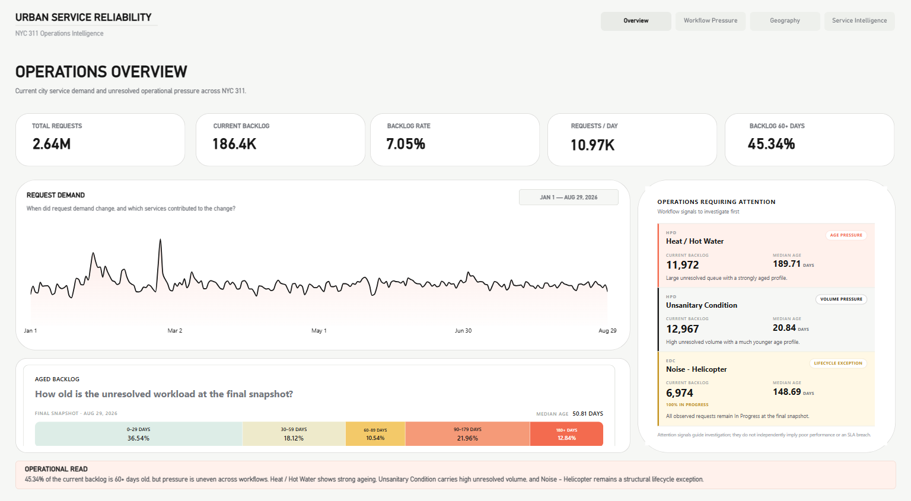

# Urban Service Reliability Analytics & BI

> **2.64M NYC 311 service requests transformed into operational intelligence — with a Power BI experience designed to feel more like a modern SaaS product than a traditional BI report.**



## Overview

**Urban Service Reliability Analytics & BI** is an end-to-end analytics project built around real NYC 311 service-request data.

The goal is not simply to count complaints.

The project asks operational questions such as:

- Where is unresolved demand accumulating?
- Which services carry the largest and oldest backlogs?
- Does high request volume actually mean poor service reliability?
- Where do recurring geographic pressure patterns appear?
- Which workflows deserve operational attention first?

The project combines:

**NYC Open Data → Python → Data Quality & Business Rules → SQL / Gold Layer → Power BI → Custom Bklit-inspired visuals**

---

## Why this project is different

Most public-data dashboards stop at:

> request count → chart → dashboard

This project goes further.

It separates:

**Demand**  
from  
**Backlog**  
from  
**Backlog Age**  
from  
**Resolution Behaviour**  
from  
**Geographic Recurrence**

It also explores a second idea:

> **Power BI dashboards do not have to look like traditional Power BI dashboards.**

The dashboard uses custom visuals, motion, interaction, modern card layouts and a SaaS-inspired visual system using **Bklit UI patterns and AXON-inspired design principles**.

---

## Dataset

**Source:** NYC Open Data — 311 Service Requests from 2020 to Present  
**Dataset ID:** `erm2-nwe9`

Project scope:

```text
2026-01-01 inclusive
→
2026-08-30 exclusive
```

Equivalent to **January 1 – August 29, 2026**.

### Scale

| Metric | Value |
|---|---:|
| Service Requests | **2,644,153** |
| Current Backlog | **186,436** |
| Backlog Rate | **7.05%** |
| Average Requests / Day | **10,971.6** |
| Median Resolution | **6.94 hours** |
| P90 Resolution | **325.21 hours** |
| Median Backlog Age | **50.81 days** |
| P90 Backlog Age | **193.04 days** |

---

## One of the strongest findings

High demand does **not** automatically mean high operational pressure.

A service can have:

- huge request volume,
- low unresolved backlog,

while another can have:

- lower demand,
- a much higher backlog rate,
- substantially older unresolved work.

That makes **volume, backlog, backlog rate and backlog age separate operational signals**.

### Aged backlog

| Age | Share of Current Backlog |
|---|---:|
| 30+ days | **63.46%** |
| 60+ days | **45.34%** |
| 90+ days | **34.80%** |
| 180+ days | **12.84%** |

---

# Dashboard

## Overview

A citywide operational snapshot combining demand, backlog and service reliability.


---

## Workflow & Backlog

Designed to identify where unresolved work accumulates and where ageing creates operational pressure.


---

## Geography & Recurrence

Explores geographic concentrations and recurring local service-demand patterns.


---

## Service Intelligence

Moves from citywide signals into individual service workflows and underlying operational behaviour.


---

# Power BI — designed differently

The dashboard intentionally avoids relying only on standard Power BI visuals.

Custom visual development includes concepts such as:

- Request Demand
- Aged Backlog
- Workflow Pressure
- Top Workflow Ranking
- Service Portfolio
- Operations Attention
- Selected Service Profile
- Selected Geography Profile
- Geographic Hotspots
- Recurrence Patterns

Custom visuals are developed using:

```text
React
TypeScript
Power BI Visuals API
D3
Motion
pbiviz
Bklit-inspired components
```

The design approach focuses on:

- motion
- interaction
- large information hierarchy
- minimal cards
- SaaS-style layouts
- cleaner visual storytelling

> **Bklit is used as a design/component influence. AXON is a visual-design inspiration, not a project dependency.**

---

# End-to-End Architecture

```text
NYC Open Data API
        │
        ▼
Bronze Layer
compressed raw JSON
        │
        ▼
Profiling + Validation
        │
        ▼
Silver Layer
normalized Parquet
        │
        ├── lifecycle flags
        ├── backlog flags
        ├── request age
        ├── duration bands
        └── geography validation
        │
        ▼
Python Analysis
        │
        ▼
Gold Analytical Outputs
        │
        ▼
SQL / MySQL Layer
        │
        ▼
Power BI Semantic Model
        │
        ▼
Custom Interactive Dashboard
```

---

# Data Quality Matters

The project intentionally preserves real-world data problems rather than silently deleting them.

Validation identified:

| Data-quality condition | Count |
|---|---:|
| Duplicate Unique Keys | **0** |
| Lifecycle mismatches | **20,386** |
| Negative resolution durations | **650** |
| Future Closed Dates | **1** |
| Zero-duration closures | **56,511** |
| Requests over 180 days | **855** |
| Missing coordinate pairs | **65,793** |
| Invalid ZIP formats | **2** |

Important business rules include:

- current request **status**, not `closed_date`, defines backlog;
- Due Date is not treated as a citywide SLA;
- unresolved geographic records remain in the dataset;
- duplicate-looking fingerprints are treated as audit signals rather than automatically deleted.

---

# Analytical Work

The project includes dedicated analysis for:

```text
01  Backlog Analysis
02  Agency & Service Analysis
03  Geographic Hotspots
04  Temporal Service Analysis
05  Recurring Local Demand
06  EDC / Helicopter Lifecycle Investigation
07  Closure Pattern Analysis
08  Analytical Synthesis
```

The investigation also uncovered unusual lifecycle behaviour and recurring ~60-day closure patterns in selected workflows.

---

# Technology Stack

### Data & Analytics

- Python
- Pandas
- NumPy
- PyArrow
- Requests
- PyYAML
- Pytest

### Data Layer

- NYC Open Data API
- JSON / JSON.GZ
- Parquet
- SQL
- MySQL

### Business Intelligence

- Power BI
- DAX
- Power BI Visuals API
- `pbiviz`

### Custom Visualization

- React
- TypeScript
- D3
- Motion
- Bklit UI patterns

### Development

- Git
- GitHub
- VS Code

---

# Repository Structure

```text
Urban-Service-Reliability-Analytics-and-BI/
│
├── assets/
│   └── dashboard/
│
├── docs/
│   ├── project charter
│   ├── business problem
│   ├── analytical questions
│   ├── data dictionary
│   ├── data-quality report
│   ├── business rules
│   └── findings
│
├── powerbi/
│   └── Urban_Service_Reliability_Analytics.pbix
│
├── src/
│   ├── ingestion
│   ├── transformation
│   ├── validation
│   └── analysis
│
├── sql/
│
├── visual-lab/
│
├── visuals/
│   └── custom Power BI visuals
│
├── tests/
│
├── config.yaml
├── requirements.txt
└── README.md
```

Large raw datasets and generated analysis outputs are intentionally excluded from GitHub.

---

# Reproducing the Pipeline

## 1. Create the environment

```powershell
python -m venv .venv
.\.venv\Scripts\Activate.ps1
pip install -r requirements.txt
```

## 2. Acquire NYC 311 data

```powershell
python src/acquire_311_data.py
```

## 3. Build the Silver layer

```powershell
python src/build_silver.py
```

## 4. Validate

```powershell
python src/validate_service_requests.py
```

## 5. Run analyses

```powershell
python src/analysis/01_backlog_analysis.py
python src/analysis/02_agency_service_analysis.py
python src/analysis/03_geographic_hotspots.py
python src/analysis/04_temporal_service_analysis.py
python src/analysis/05_recurring_local_demand.py
```

Additional investigation scripts are available under the analysis modules.

## 6. Run tests

```powershell
pytest
```

---

# What this project demonstrates

This project is intended to demonstrate more than dashboard construction.

It combines:

**Data Engineering**  
→ API ingestion, Bronze/Silver processing and reproducibility

**Data Quality**  
→ lifecycle validation, anomaly preservation and explicit business rules

**Analytics**  
→ backlog, ageing, service, temporal and geographic investigation

**BI Engineering**  
→ Power BI modelling and analytical storytelling

**Frontend / Visualization Engineering**  
→ React + TypeScript custom Power BI visuals

**Design**  
→ applying a modern SaaS-style visual language to business intelligence

---

## Author

**Hardik Waghmare**

Data Analytics · Data Science · AI/ML

GitHub: [Punerihardik11](https://github.com/Punerihardik11)